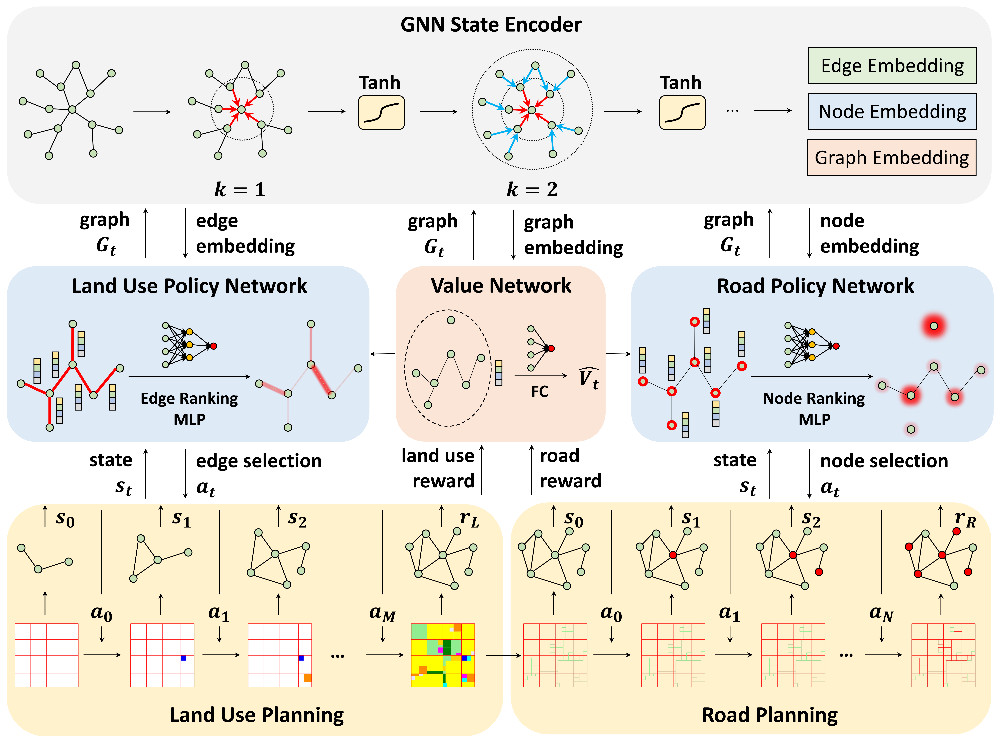
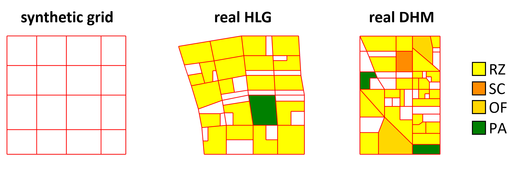

# DRL urban planning

---

This repo contains the source codes and data for our paper:

Yu Zheng, Yuming Lin, Liang Zhao, Tinghai Wu, Depeng Jin, Yong Li,  **Spatial planning of urban communities via deep reinforcement learning**.


## Installation 

### Environment
* **Tested OS:** Linux
* Python >= 3.8
* PyTorch >= 1.8.1
### Dependencies:
1. Install [PyTorch](https://pytorch.org/get-started/previous-versions/) with the correct CUDA version.
2. Set the following environment variable to avoid problems with multiprocess trajectory sampling:
    ```
    export OMP_NUM_THREADS=1
    ```
   
## Data
The data used for training and evaluation can be found in [urban_planning/cfg/test_data](urban_planning/cfg/test_data).
We provide all the three scenarios used in our paper, including one synthetic grid community in [urban_planning/cfg/test_data/synthetic](urban_planning/cfg/test_data/synthetic), and two real-world communities, HLG and DHM, with and without planning concepts, in [urban_planning/cfg/test_data/real](urban_planning/cfg/test_data/real).
The data for the real-world communities are collected from the widely used [OpenStreetMap](https://www.openstreetmap.org/) (OSM) using [OSMnx](https://github.com/gboeing/osmnx).
For each case, we provide the following data:
* `init_plan.pickle`: the initial conditions of the community in [geopandas.GeoDataFrame](https://geopandas.org/en/stable/docs/reference/api/geopandas.GeoDataFrame.html) form, including the initial land blocks, roads, and junctions.
* `objectives.yaml`: the planning objectives (requirements) of the community in [yaml](https://yaml.org/) form, including the required number/area of different functionalities, and the minimum/maximum area of each land use type.

The figure below illustrates the initial conditions of the three scenarios.


With the initial conditions and planning objectives, the agent will generate millions of spatial plans for the community in real-time during training, which are stored in the replay buffer for training.

## Training
You can train your own models using the provided config in [urban_planning/cfg/exp_cfg/real](urban_planning/cfg/exp_cfg/real).

For example, to train a model for the HLG community, run:
```
python3 -m urban_planning.train --cfg hlg --global_seed 111
```
You can replace `hlg` to `dhm` to train for the DHM community.

To train a model with planning concepts for the HLG community, run:
``` 
python3 -m urban_planning.train --cfg hlg_concept --global_seed 111
```
You can replace `hlg_concept` to `dhm_concept` to train for the DHM community.

You will see the following logs once you start training our model:

https://user-images.githubusercontent.com/27959377/242561690-c01480a2-cedf-4889-8506-14add002227a.mp4

## Visualization
You can visualize the generated spatial plans using the provided notebook in [demo](demo).

## Baselines
To evaluate the centralized heuristic, run:
```
python3 -m urban_planning.eval --cfg hlg --global_seed 111 --agent rule-centralized
```

To evaluate the decentralized heuristic, run:
```
python3 -m urban_planning.eval --cfg hlg --global_seed 111 --agent rule-decentralized
```

To evaluate the geometric set-coverage adapted baseline, run:
```
python3 -m urban_planning.eval --cfg hlg --global_seed 111 --agent gsca
```

To evaluate the GA baseline, run:
```
python3 -m urban_planning.train_ga --cfg hlg --global_seed 111
python3 -m urban_planning.eval --cfg hlg --global_seed 111 --agent ga
```
You can replace `hlg` to `dhm` to evaluate for the DHM community.

## License
Please see the [license](LICENSE) for further details.
