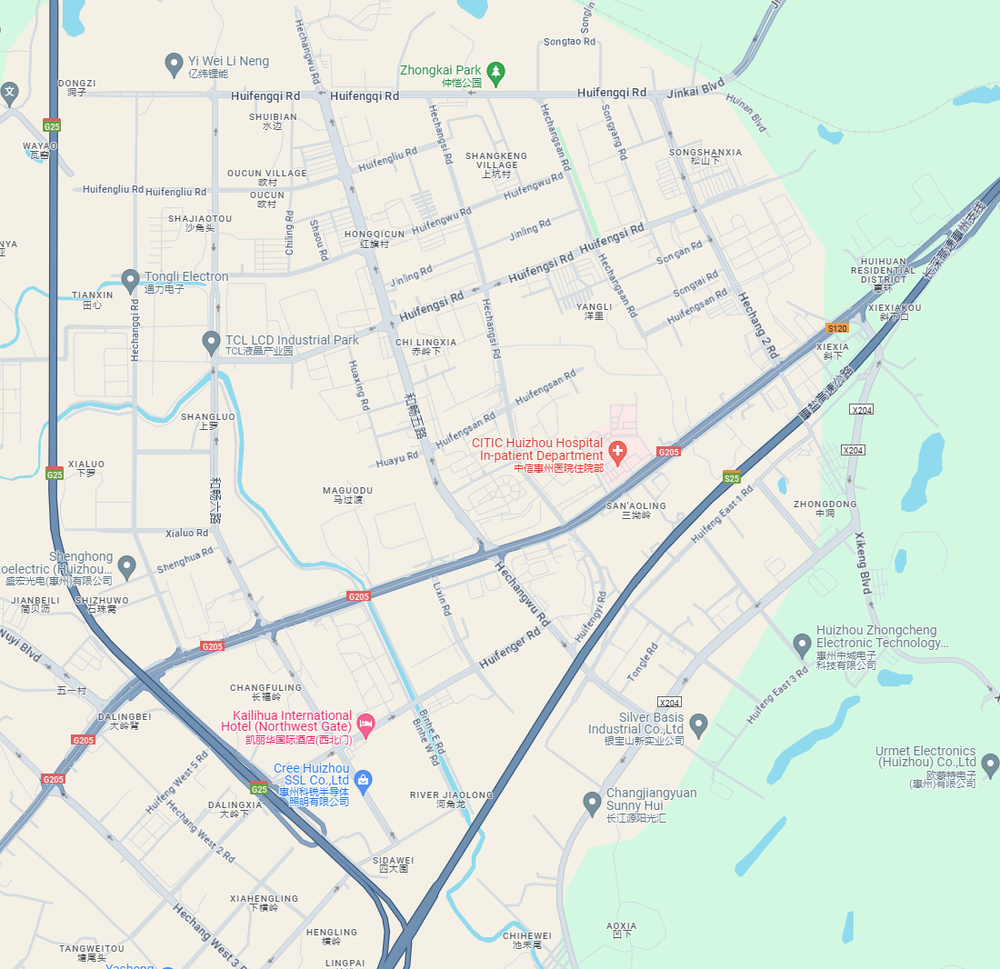
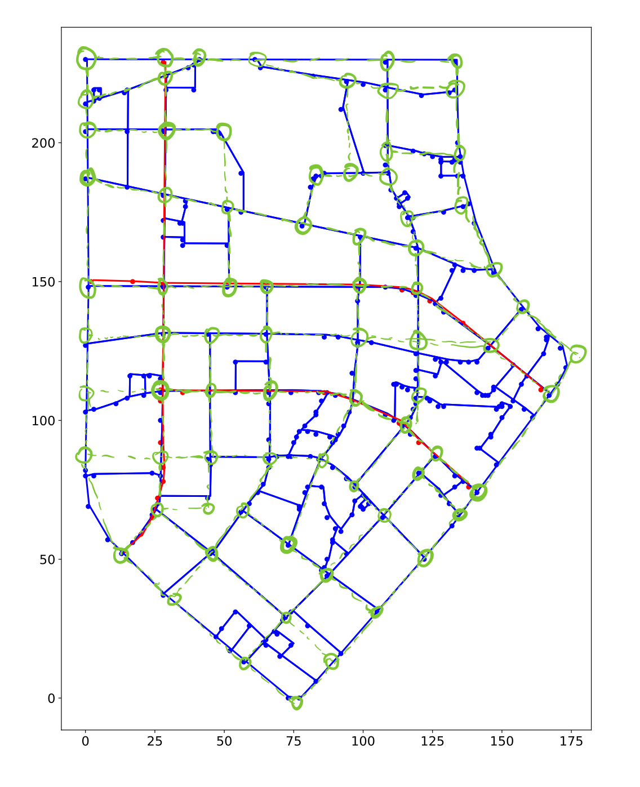
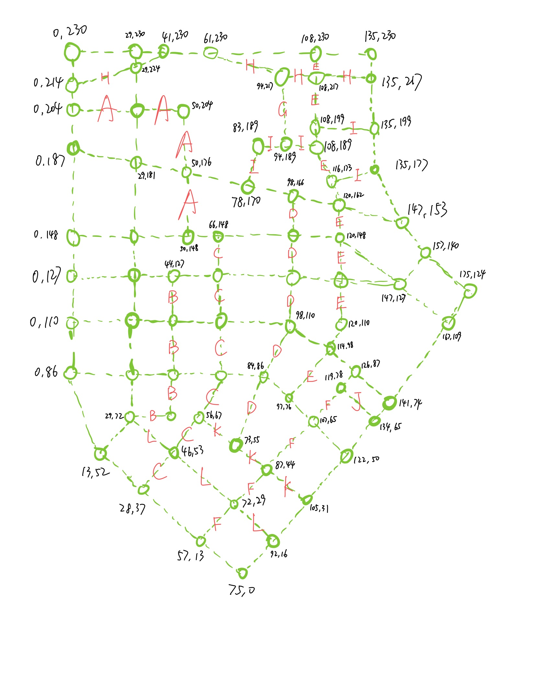

# Prepare the base map for a community in Huizhou

We illustrate the process of preparing the base map for the following community in Huizhou, China.

You need to first obtain the shapefile of the community. 
In this case, we have land.shp, line.shp, and mainroad.shp (optional) for the land use, road, and main road (optional), respectively.

You may also need to manually annotate the community map to make it simple and clear, as shown in the following figure.

| Annotated                                                           | Simplified                                                             |
|---------------------------------------------------------------------|------------------------------------------------------------------------|
|  |  |

Then just follow the provided [notebook](explore.ipynb) to prepare the base map for the community.
